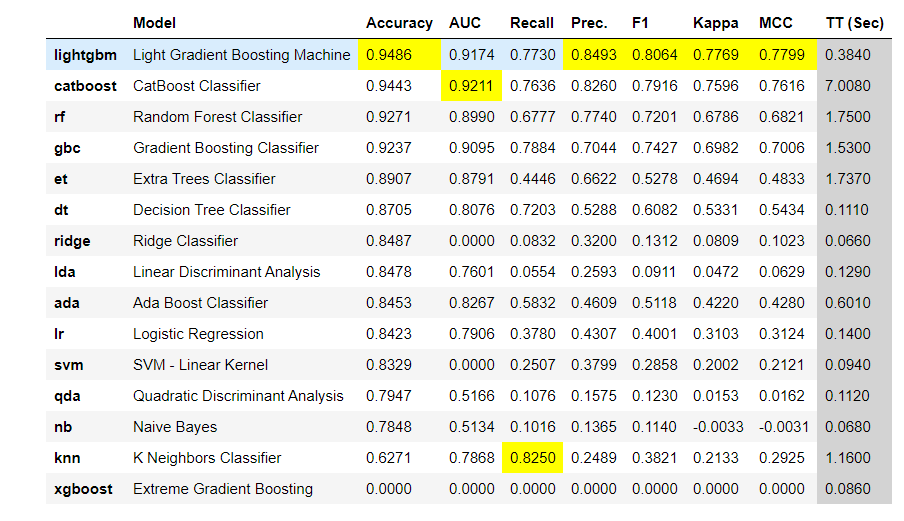
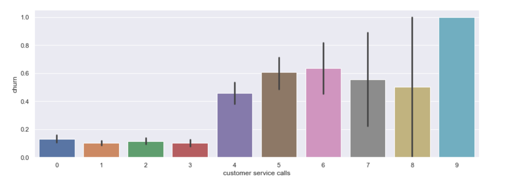
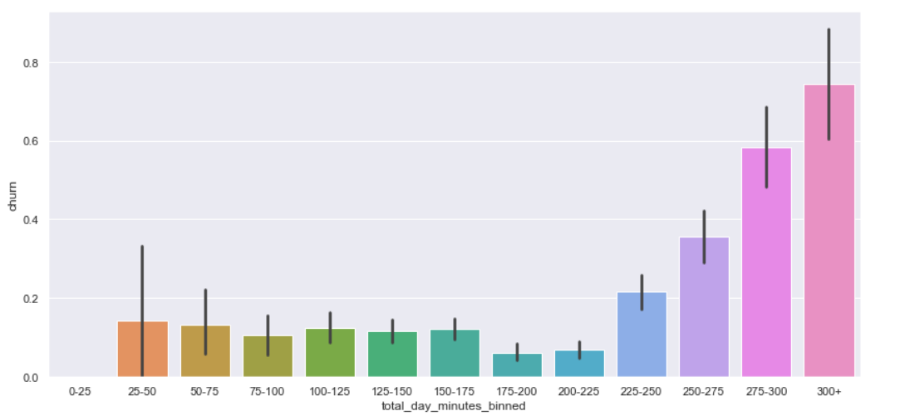

<h1 align="center">Customer Churn For SyriaTel</h1>

SyriaTel has decided to up their game in sales and they would like to determine which customers are most likely to stop using their service. We will be going through the dataset they have provided us to determine which customers have a good chance of leaving or staying with them. This information will help them encourage the 'flaky' customers to stay perhaps by providing extra incentives that will allow them to make the 'correct' decision. Please note that this is a binary classification problem and we will be using many different tools to assist us in our predictions.

## The Data
The data given to us is customer plan information for the company "Syriatel". It is available at kaggle here - https://www.kaggle.com/becksddf/churn-in-telecoms-dataset

## OSEMN Process
- Obtain
- Scrub
- Explore
- Model
- Interpret

## Purpose / Goal
The goal of this project is explain what the most common causes are for customers to leave their company. Based on those insights we draw from the data, we will give recommendations that will help them keep those customers who are likely to churn due to their similarity with other customers who have left in the past.

## Final Modeling

### Recommendations 
* People with international plan are way more likely to churn. Perhaps other companies are offering more competitive pricing 
* Minutes spent on the phone during the day are correlated with customers leaving the service
* More than 3 customer service calls suggest that they are on the brink of leaving
